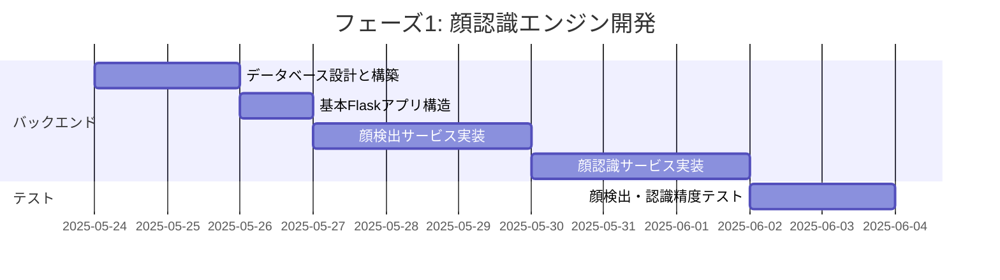
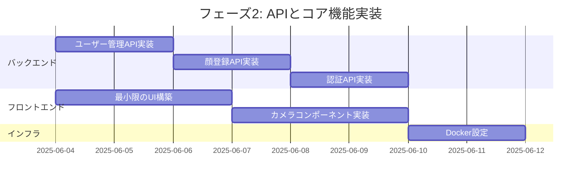
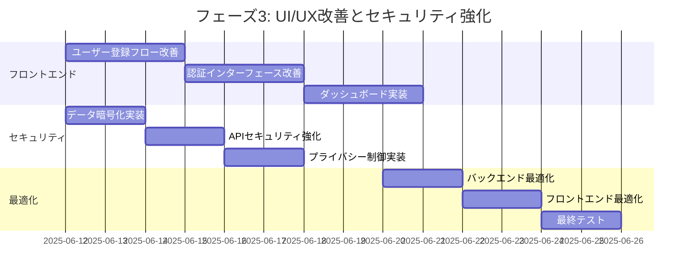
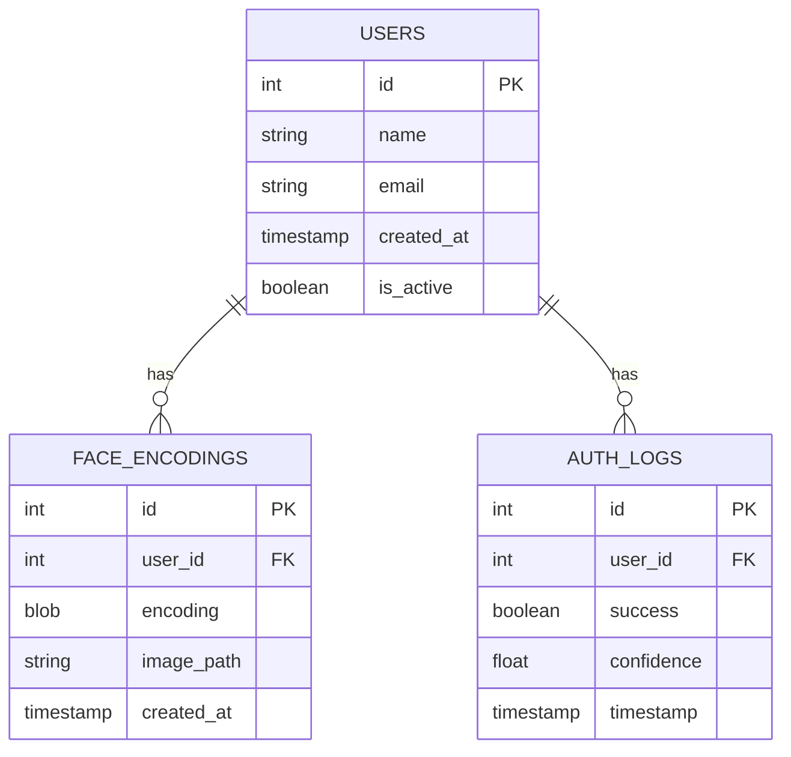
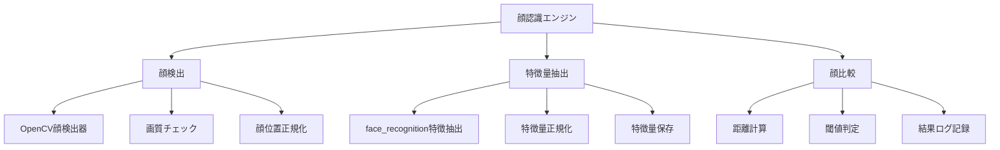
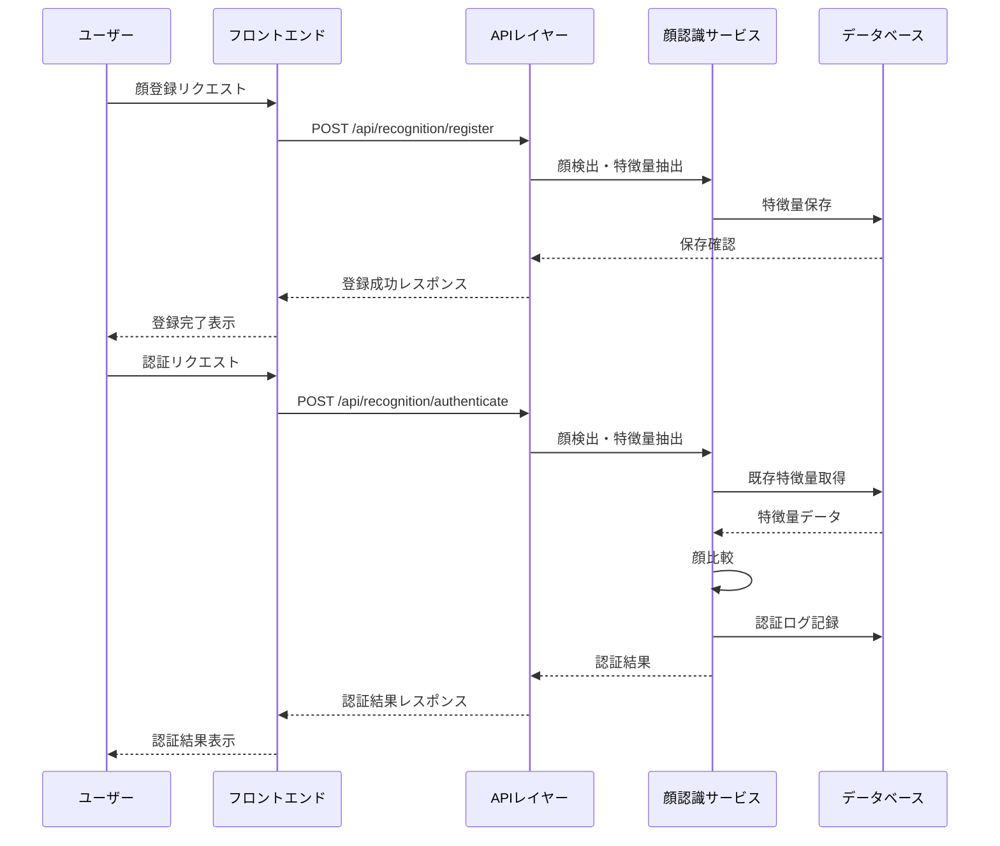

# 顔認証システム - 実装計画

## プロジェクト概要

**プロジェクト名**: Face Recognition System  
**説明**: ローカル環境で動作する顔認証システム。ユーザーの顔を登録し、リアルタイムで認証を行うWebアプリケーション。

## 技術スタック

### バックエンド
- Python 3.9+
- Flask
- OpenCV
- face_recognition
- SQLite
- NumPy

### フロントエンド
- React.js
- Tailwind CSS
- Axios

### その他
- Docker (コンテナ化)
- WebRTC (カメラアクセス)

## 実装計画（顔認識基本機能優先）

### フェーズ1: 顔認識エンジン開発（1週目）

#### 詳細タスク:

1. **データベース設計と実装**
   - SQLiteデータベースのセットアップ
   - 指示書に従ったテーブル構造の実装:
     - usersテーブル (id, name, email, created_at, is_active)
     - face_encodingsテーブル (id, user_id, encoding, image_path, created_at)
     - auth_logsテーブル (id, user_id, success, confidence, timestamp)
   - データベース初期化スクリプトの作成

2. **基本Flaskアプリケーション構造**
   - Flask, Flask-CORSのセットアップ
   - 環境変数による設定管理
   - エラーハンドリングとログ設定
   - ルート登録の基本構造

3. **顔検出サービスの実装**
   - OpenCVとface_recognitionを使用した顔検出機能
   - 以下の機能を実装:
     - `detect_faces(image)`: 画像から顔を検出
     - `extract_face_encoding(image)`: 顔の特徴量を抽出
     - `validate_face_image(image)`: 顔画像の品質チェック
   - エラーハンドリング（顔未検出、複数顔検出、低品質画像）

4. **顔認識サービスの実装**
   - 以下の機能を実装:
     - `register_face(user_id, image)`: 顔を登録
     - `authenticate_face(image)`: 顔認証を実行
     - `compare_faces(known_encodings, face_encoding)`: 顔比較
     - `get_user_encodings(user_id)`: ユーザーの顔データ取得
   - 認証閾値の設定と調整（デフォルト: 0.6）
   - 最大登録可能顔数の設定（デフォルト: 5）

5. **精度テスト**
   - 様々な条件下での顔検出テスト（照明、角度、距離）
   - 認証精度の検証（正確な認証率、誤認証率）
   - パフォーマンス測定（処理時間、リソース使用量）

### フェーズ2: APIとコア機能実装（2週目）

#### 詳細タスク:

1. **APIエンドポイントの実装**
   - ユーザー管理API:
     - `POST /api/users` - ユーザー作成
     - `GET /api/users` - ユーザー一覧取得
     - `GET /api/users/{id}` - ユーザー詳細取得
     - `PUT /api/users/{id}` - ユーザー更新
     - `DELETE /api/users/{id}` - ユーザー削除
   - 顔認識API:
     - `POST /api/recognition/register` - 顔登録
     - `POST /api/recognition/authenticate` - 顔認証
     - `GET /api/recognition/history` - 認証履歴
   - 適切なHTTPステータスコードとエラーレスポンスの設定
   - 入力値バリデーションの実装

2. **最小限のフロントエンド**
   - Reactプロジェクト設定（React 18.2.0, Tailwind CSS）
   - カメラアクセスコンポーネント:
     - WebRTCを使用したカメラアクセス
     - 顔検出枠の表示
     - 写真撮影機能
   - 基本的なユーザー登録フォーム:
     - 名前、メールアドレス入力
     - 顔写真撮影
   - シンプルな認証インターフェース:
     - カメラプレビュー
     - 認証ボタン
     - 結果表示

3. **Docker環境構築**
   - バックエンド用Dockerfile:
     - Python 3.9+ベースイメージ
     - 必要なライブラリのインストール
   - フロントエンド用Dockerfile:
     - Node.jsベースイメージ
     - Reactアプリのビルド設定
   - docker-compose設定:
     - サービス構成（backend, frontend）
     - ポート設定（backend: 5000, frontend: 3000）
     - ボリューム設定（顔画像データ、データベース）
     - 環境変数設定

### フェーズ3: UI/UX改善とセキュリティ強化（3-4週目）

#### 詳細タスク:

1. **UI/UX改善**
   - ユーザー登録フローの改善:
     - 複数角度での顔登録
     - 登録プロセスの進行状況表示
     - バリデーションの強化
   - 認証インターフェースの改善:
     - リアルタイム顔検出
     - 認証状態の視覚的フィードバック
     - エラーメッセージの改善
   - ダッシュボードの実装:
     - システム概要表示
     - 最近の認証履歴
     - 登録ユーザー数統計
     - クイックアクション

2. **セキュリティ強化**
   - データ暗号化:
     - 顔画像の暗号化保存
     - 特徴量データの保護
   - APIセキュリティ:
     - レート制限の実装
     - 入力値検証の強化
     - SQLインジェクション対策
   - プライバシー制御:
     - データ使用目的の明示
     - ユーザー同意の取得
     - データ削除機能

3. **パフォーマンス最適化**
   - バックエンド最適化:
     - 顔認識アルゴリズムの効率化
     - データベースクエリの最適化
     - キャッシング戦略の実装
   - フロントエンド最適化:
     - コンポーネントのメモ化
     - 画像処理の効率化
     - バンドルサイズの最適化
   - 最終テスト:
     - パフォーマンステスト
     - セキュリティテスト
     - ユーザビリティテスト

## 技術的実装詳細

### データベーススキーマ

### 顔認識エンジンのコアコンポーネント

### データフロー

## 開発方針と注意点

1. **段階的アプローチ**
   - 各フェーズで動作する最小限の機能を実装
   - 各機能の完了後にテストを実施
   - 問題点を早期に発見し修正

2. **コード品質**
   - 一貫したコーディング規約の適用
   - ユニットテストの作成
   - コードレビューの実施

3. **セキュリティ考慮事項**
   - 生体認証データの適切な取り扱い
   - プライバシーに配慮した設計
   - セキュリティベストプラクティスの適用

4. **パフォーマンス目標**
   - 顔検出: 2秒以内
   - 認証処理: 3秒以内
   - ユーザー登録: 5秒以内

5. **技術的課題への対応**
   - カメラ権限の適切な処理
   - 計算リソースの効率的な使用
   - ブラウザ互換性の確保

## 顔認識アルゴリズムの最適化戦略

1. **前処理の最適化**
   - 画像の正規化（明るさ、コントラスト調整）
   - 顔の位置合わせと切り抜き
   - ノイズ除去

2. **特徴抽出の改善**
   - 複数の角度からの顔サンプル取得
   - 特徴量の平均化
   - 重要特徴の重み付け

3. **認証精度向上**
   - 適応的閾値の実装
   - 信頼度スコアの計算
   - 誤認証率の最小化

## リスク評価と対策

1. **技術的リスク**
   - **様々な条件下での顔認識精度**
     - 対策: 登録時に複数の顔サンプル取得、照明正規化のための前処理
   
   - **パフォーマンスのボトルネック**
     - 対策: アルゴリズムの最適化、キャッシング戦略、効率的な画像処理

2. **セキュリティリスク**
   - **生体認証データの保護**
     - 対策: 暗号化、アクセス制御、データ最小化
   
   - **不正アクセス**
     - 対策: レート制限、適切な認証、入力値検証

3. **ユーザー体験リスク**
   - **カメラ権限の問題**
     - 対策: 明確な指示、代替認証方法の提供
   
   - **認証失敗**
     - 対策: 適切なエラーハンドリング、リトライメカニズム、代替検証

## 最終更新

- 作成日: 2025年5月23日
- バージョン: 1.0